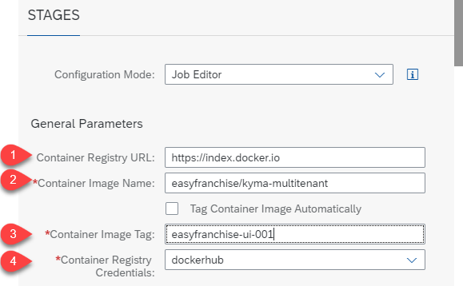
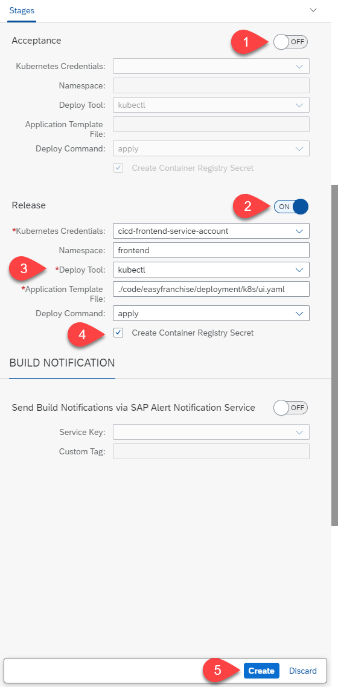

# Create a Job for the Easy Franchise UI

In this chapter we will create a job that builds and deploys the Easy Franchise UI in your Kyma cluster.

## Launch the SAP Continues Integration & Delivery Service

   1. In the **EasyFranchise** subaccount, navigate to **Instances and Subscriptions**.
   2. Choose **Go to Application** in the menu of the **Continuous Integration & Delivery** application.

      

## Configure the Required Credentials in the SAP Continues Integration & Delivery Service

### Credentials for the GitHub Repository
We need credentials for accessing the GitHub repository: 

1. Open the **Credentials** tab and choose **+** to create a new credential.
   
    

2. The **Create Credentials** dialog opens. Enter the following values:  
   
   * Name: The name of the credential, for example **github.com**
   * Description: **Personal Access Token for the easyfranchise day2 Github Repo**
   * Enter your GitHub username and the personal access token that you have created above.
   * Choose **Create**.
      
     

### Credentials for the Docker Hub

We also need credentials for the Docker hub:
1. Choose **+** to create a another credential and enter a name and description for the credential, for example **dockerhub**.
2. Enter the credential information like this:

   ``` json
   {
      "auths": {
         "https://<Container Registry URL>": {
            "username": "<USERNAME>",
            "password": "<PASSWORD OR ACCESS TOKEN>"
         }
      }
   }
   ```

3. Choose **Create**. 

   

### Credentials for the Service Account

Configure the **Service account** credentials for the **frontend** namespace: 

1. Choose **+** to create a another credential and enter a name and description.
2. Paste the content of the **kubeconfig.yaml** file which you have downloaded for the service account of the **frontend** namespace (see above).
3. Choose **Create**.

   

## Create Continuous Integration and Delivery Job for the Easy Franchise UI and Configure the General Information

1. In the **SAP Continuous Integration and Delivery** application, choose **+** to create a new job.
2. Enter a name and description for the job, for example **EasyFranchise-UI**.
3. In the **Repository** dropdown menu, select **Add Repository** to add your GitHub source repository.
4. Choose the **Branch** of your repository (e.g. main)
5. In the **Pipeline** dropdown menu, select "Container-Based Applications"


   
4. In the **Add Repository** dialog, enter the following values:  

   * Enter a name and the URL of your git repository. 
   * In the credentials dropdown menu, select your GitHub credentials.
   * Choose **Remove** to disable the webhook (we'll do that later).
   * Choose **Add** to finalize the repository configuration.

     

## Configure "Staging" in the Continuous Integration and Delivery Job

In the **Staging** part of the Continuous Integration and Delivery Job, we have to configure various things.

Configure the **General Parameters**:

1. Enter the URL to the container registry, for example <https://docker.io> for Docker Hub.
2. Enter the image name. For Docker Hub it follows this format: **"username"/"repository name"/"image-name"**. As a free Docker Hub user, you only have one private repository that you can use, therefore we are using username and repository name as image name and make the component name part of the tag. That way, we can push multiple images to the same repository.
3. Usually the tag should be your version number of the image and ideally you choose the **Tag Container Image Automatically** to make sure you receive a new version every build. But as written above, we will use the repository for more than one image and therefore select a dedicated image tag so we can better see what is happening in our registry.
4. **Container Registry Credentials**: select your already created Docker Hub credential.

    

Configure the **Build**:

1. Check that **Build** is switched on.
2. Enter the path to the dockerfile for the Easy Franchise UI: ```/code/easyfranchise/deployment/docker/Dockerfile-ui```

    

Configure **Acceptance** and **Release**:

1. Disable the **Acceptance** step.
2. Enable the **Release** step.
3. Fill in the rest of the information:
   * Namespace: frontend
   * Deploy Tool: kubectl
   * Application Template File: ```code/easyfranchise/deployment/k8s/ui.yaml```
   * Deploy Command: apply

4. Select **Create Container Registry Secret** checkbox. This will automatically create a secret in the cluster so that the image can be pulled from your repository.
5. Choose **Create** to finish the job definition.

   

## Run the EasyFranchise-UI Job

To run the EasyFranchise-UI Job you, follow these steps:

1. Select the job.
2. Choose **Trigger build** arrows to trigger your fist build.
3. You should see a new build job being initialized.
4. After the job has been finished, it should look like this:

    
