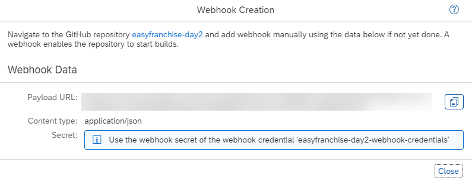

# Create a Webhook for the GitGub Repository

Now that we have created the jobs for both of our UI's we can trigger the build manually. But what we actually want is that the build is triggered each time when there is a change in the repository automatically. Therefore we will configure a webhook that reacts on changes.

## Enable the Webhook in our repository

1. In the overview screen click on **Repositories**
2. Select your repository
3. Click on **Edit**

   

1. In the repository edit screen click on **Add**

   

1. Use Type GitHub and generate a new webhook credential
2. Click on **Save**

   

## Get the webhook data

1. Click on the **...** in the repository details
2. Click on **Webhook Data**

   

* Either note down the payload URL and the secret or leave the window open, as we need those values for the webhook configuration

  

## Configure the webhook in GitHub

1. Open your repository in GitHub and click on **Settings**
2. Select **Hooks**
3. Click on **Add webhook**

   

4. In the Webhooks Dialog
   * Payload url: use the Payload URL (see  chapter above)
   * Contend Type: application/json 
   * Secret: enter the secret (see chapter above)
   * Click on **Add webhook**

   
  

## Do a test Commit to Trigger the Build

In order to test the webhook you can perform a change in the Easy franchise application. Let test it by changing something in the Easy Franchise UI.

1. Open the file [UserProfile.vue](../../../code/easyfranchise/source/ui/src/components/UserProfile.vue).

1. Change the header H1 from **User Profile** to **User Details**.
   ```
   <h1 class="mt-5 mb-5 text-center">User Details</h1>
   ```
1. Open the Easy Franchise application to see if the UI is correctly updated. On the top right corner in the bar, click on the user icon.
   

1. Verify that the page header is called now **User Details**.

1. Save the file and push the changes to the repository.

As soon as the changes are pushed, both jobs are triggered automatically. After the job is finished open the application UI and check if your changes are active.

Note: As we have only changed one of the ui's it would be unnecessary to trigger both of the jobs. But as we use one and the same repository for each build job we cannot prevent that.
