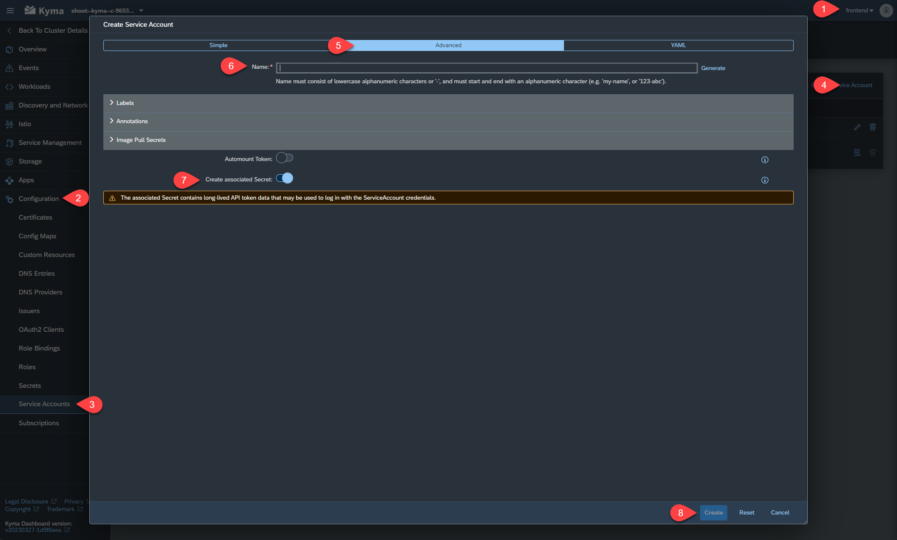
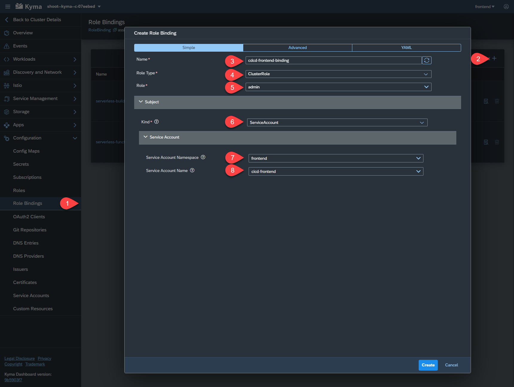

# Create a GitHub Repository and a Kyma Service Account

In order to use the SAP Continuous Integration and Delivery service we need to prepare the environment as described below.

## Create Your Own GitHub Repository

You need your own GitHub repository to be able to configure a webhook. The easiest way to achieve this is to have your own GitHub user and to fork the [easyfranchise-day2 repository](https://github.com/SAP-samples/btp-kyma-day2-operations). 
See [GitHub Docs: Fork a repo](https://docs.github.com/en/get-started/quickstart/fork-a-repo).

In theory, you can use any GitHub repository, as long as it can be accessed from the Internet, as the Continuous Integration and Delivery service job needs to have access to this repository.

To enable the communication between your GitHub repository and your job, you need to provide credentials to the job. You can do this by creating a personal access token for your user as described at [GitHub Docs: Creating a personal access token](https://docs.github.com/en/authentication/keeping-your-account-and-data-secure/creating-a-personal-access-token). The token needs to have at least the **repo** and the **admin:repo_hook** permissions including their children.

## Create a Personal Docker Hub Account

The Docker images that are being built will be uploaded directly to a Docker image repository. The easiest option is to create a personal [docker hub account](https://hub.docker.com/) and use a private repository.

## Create a Continuous Integration and Delivery Service Account 

As we will also perform a deployment to a **Kyma** cluster, we need to create a **Service Account** which we can use to authenticate against our cluster.

You can create a service account either using the **Kubernetes Command Line Tool** as described in the [Create a Kyma service account](https://developers.sap.com/tutorials/kyma-create-service-account.html) tutorial or using the Kyma Dashboard as shown below:

1. In the Kyma Dashboard navigate to the **frontend** namespace.
2. Expand the **Configuration** menu on the left side.
3. Choose **Service Accounts**.
4. Choose **Create Service Account** and then choose **+** to open the **Create Service Account** dialog.
5. In the **Create Service Account** dialog, enter the name for the Service Account, for example **cicd-frontend**.
6. Choose **Create**.
  
   

##  Create a Cluster Role Binding

We need to create a **Role Binding**, so that you are able to access the Service Account you just created.

1. Make sure you have still selected the namespace **frontend**. Navigate to **Cluster Role Bindings** which is under **Configuration** menu.
2. Choose **+** to create a new Role Binding.
3. In the **Create Role Binding** dialog, fill in the following fields: 
   * Name: enter a name, for example **cicd-fontend-binding**
   * Role: select **admin (CRI)**. (Note: In a productive environment, you would like to restrict the permissions of a service account to the minimal scope and not grant admin privileges, but for a tutorial this is of no concern.) 
   * Kind: **ServiceAccount**  
   * Service Account Namespace: **frontend** 
   * Service Account Name: **cicd-frontend** (or the name you chose for your Service Account) 
4. Choose **create**.
  
   

## Download the Kubeconfig of the Service Account

1. Navigate back to **Service Accounts** and select the created service account.
2. Download the kubeconfig to your local file system. We will need it later, when configuring the build job. 
   
   
