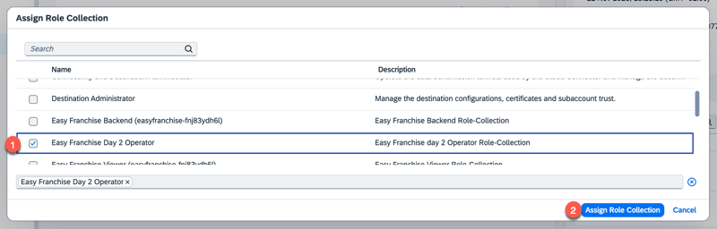

# Run the Metering Scenario on Kyma

This chapter explains how to check that the metering scenario was deployed correctly and see the deployed services and applications in action.

## Check that the Database is running

1. Open your **EasyFranchise-Day2** account in SAP BTP Cockpit.
1. Choose **Services** > **Instances and Subscriptions** in the left navigation tree.
1. Select your Database and expand the "..." and select **View Dashboard**
1. Check in the opened dashboard that the  database status is **running**.

## Create Metering Data

If it's not already done, you have to create metering data by using the Easy Franchise UI now.

1. Open the **City Scooter** subaccount in the SAP BTP Cockpit and go to **Instances and Subscriptions**. 

1. You can open the base mission UI by clicking the application **Easy Franchise (easyfranchise-day2...)**, where you will need to login. Then the City Scooter UI **Franchises Overview** should be displayed. 

Opening the Easy Franchise UI is enough to trigger new metering data in the database.

## Display Metering Dashboard UI

To view the metering data you have to open the day2 UI that you deployed in the last chapter.

1. Return to the **EasyFranchise** subaccount in the SAP BTP Cockpit. 

1. Go to **Security** > **Users**, select your name and choose **Assign Role Collection**.

1. Select the role **Easy Franchise Day 2 Operator** and choose**Assign Role Collection**.

1. Now navigate to the **Overview** section and open the Kyma dashboard.

1.Select the namespace **day2-operations** and go to **API Rules** under **Discovery and Network**.

1. Select the **Host URL** to open the Day2 UI to get the list of active users per tenant. All data is aggregated for the selected month. If you followed the previous steps, you should see at least one entry for the current month.

