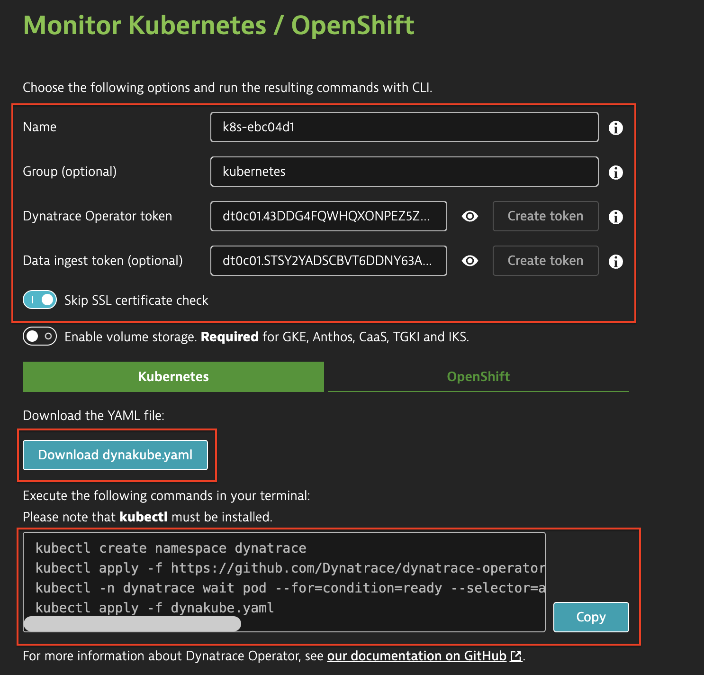
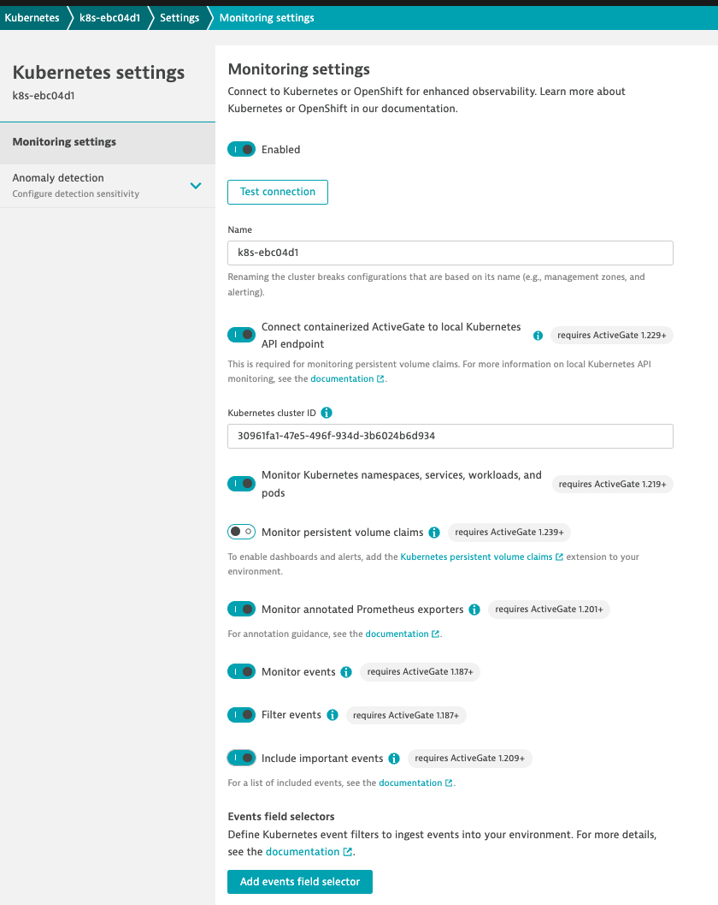

# Monitoring Kyma in Dynatrace

## Introduction

Dynatrace is an Application Performance Management tool which provides full-stack insights into your application and its runtime environment. In this chapter, we will show how to enable monitoring Kyma runtime related metrics in Dynatrace. 

## Getting Dynatrace Environment

As Dynatrace requires commercial license, different ways of requesting Dynatrace environments are described.

* Create a Dynatrace trial environment at [Dynatrace](https://www.dynatrace.com/trial/new/) with no cost.

* Purchase license through Dynatrace or SAP.

* As an SAP employee you can request an internal Dynatrace environment 

You only need to choose one of above options to request a Dynatrace environment. 

## Deploy Dynatrace Operator

1. Disable Istio injection into Dynatrace namespace in Kyma.

Kyma uses Istio side-car injection to allow tracing of built-in components. The `dynatrace` namespace must be excluded from this injection for improved performance and stability. To disable this, add the label `istio-injection=disabled` to the `dynatrace` namespace **before** installing the Dynatrace Operator.

```
kubectl create namespace dynatrace
kubectl label ns dynatrace istio-injection=disabled --overwrite

```

2. Deploy Dynatrace Operator

Dynatrace provides a fully-automated installer script to enable both the Kubernetes cluster, and cluster workload monitoring. It deploys OneAgent on each Kubernetes cluster node via the [Dynatrace Operator](https://github.com/Dynatrace/dynatrace-operator), which monitors the Kubernetes cluster node host, and processes running in pods on the cluster.

The steps of installing Dynatrace Operator differ slightly depending on how you request a Dynatrace environment. Following section assumes that you receive a Dynatrace environment from SAP.  Difference will be mentioned wherever necessary when using **Dynatrace trial environment** 

Navigate to your Dynatrace environment and go to **Deployment Status** > **Add new host** > **Kubernetes**. Enter following information:

- Name: Your Kubernetes cluster appears with this name in Dynatrace
- Group: kubernetes
- Dynatrace Operator token: Click on "Create token" to automatically generate the required token.
- API Token: Click on "Create token" to automatically generate the required token.
- Toggle `Skip SSL certificate check`, as the Kubernetes cluster API has no valid SSL certificate in most cases



Download the `dynakube.yaml` file, copy the commands from the page and execute them against your Kyma cluster. The commands create namespace `dynatrace` in which all resources are deployed.

In case you are using **Dynatrace trial environment**, this step is slightly different. Navigate to **Infrastructure** > **Kubernetes** > **Connect automatically via Dynatrace Operator**, fill in necessary information and follow the steps.

Once the Dynatrace Operator was installed, you can configure the Kubernetes integration via **Infrastructure** > **Kubernetes** > select the connected Kubernetes cluster, which leads to the monitoring page of newly added cluster. Then click on the **...** on the top right corner > select **Settings**




You can test connection from Dynatrace to your Kubernetes cluster by clicking on button "Test Connection". It should return "Successfully connected to the Kubernetes API". 

Make sure following settings are switched on and click on "Save Changes":

- Connect containerized ActiveGate to local Kubernetes API endpoint
- Monitor Kubernetes namespaces, services, workloads and pods.
- Monitor annotated Prometheus exporters
- Monitor events
- Filter events
- Include important events

Now you have successfully deployed Dynatrace Operator. Next we will enable inject metrics from Istio/Envoy and Kyma system metrics into Dynatrace.

## Configure Istio/Envoy Monitoring with Dynatrace

Kyma comes with service-to-service communication and proxying (Istio-based service mesh). Istio and Envoy metrics can be ingested into Dynatrace via [Prometheus integration](https://www.dynatrace.com/support/help/how-to-use-dynatrace/infrastructure-monitoring/container-platform-monitoring/kubernetes-monitoring/monitor-prometheus-metrics/) and pre-build dashboard. You can set up the Istio and Envoy service mesh extension to get Istio dashboards and alerts for those metrics.

1. Enable Prometheus monitoring and Envoy technology in Dynatrace:
   - Go to **Infrastructure** > **Kubernetes**, look for your cluster and select **Action** > **Settings**, and turn on `Monitor annotated Prometheus exporters. (If not yet done in previous step)

   - Go to **Settings** > **Monitoring** > **Monitored technologies**. Find **Envoy** in the list and click the pencil icon on the far right, and turn on **Monitor Envoy** and save changes.


2. Start ingesting **Istiod (control plane) metric**s by annotating the Istiod service:

    Suppose you have full permission and have set the kubeconfig file targeting the Kubernetes cluster where Kyma is running. Adapt the metric keys in the filter as needed if you would like to collect additional metrics.

```shell
  kubectl annotate --overwrite service istiod -n istio-system \
  metrics.dynatrace.com/port='15014' \
  metrics.dynatrace.com/scrape='true' \
  metrics.dynatrace.com/filter='{
  "mode": "include",
  "names": [
 "citadel_server_csr_count",
 "citadel_server_success_cert_issuance_count",
 "galley_validation_failed",
 "galley_validation_passed",
 "grpc_server_msg_received_total",
 "grpc_server_msg_sent_total",
 "pilot_conflict_inbound_listener",
 "pilot_conflict_outbound_listener_http_over_current_tcp",
 "pilot_conflict_outbound_listener_tcp_over_current_http",
 "pilot_conflict_outbound_listener_tcp_over_current_tcp",
 "pilot_k8s_cfg_events",
 "pilot_push_triggers",
 "pilot_services",
 "pilot_virt_services",
 "pilot_xds_pushes",
 "pilot_xds",
 "sidecar_injection_requests_total",
 "sidecar_injection_success_total"
 ]
  }'    
```

3. Start ingesting **Envoy (data plane) metrics** by annotating your own services. In an Istio/Envoy service mesh you deploy your own services with an Envoy sidecar proxy. The following command will annotate all services in the specified namespace to scrape Envoy data plane metrics. Adapt the metric keys in the filter as needed if you would like to collect additional metrics. To avoid port conflicts with sidecars, applications should not use any of the ports used by Envoy. You can check the [ports used by Istio sidecar proxy (Envoy)](https://istio.io/latest/docs/ops/deployment/requirements/#ports-used-by-istio).

Please make sure adjust `<your_namespace>` with your namespace.
```shell

$ kubectl annotate --overwrite service --all -n <your_namespace> \
  metrics.dynatrace.com/port='15090' \
  metrics.dynatrace.com/scrape='true' \
  metrics.dynatrace.com/path="/stats/prometheus" \
  metrics.dynatrace.com/filter='{
   "mode": "include",
   "names": [
     "istio_requests_total",
     "istio_tcp_received_bytes_total",
     "istio_tcp_connections_closed_total",
     "istio_tcp_connections_opened_total",
     "istio_tcp_sent_bytes_total",
     "envoy_cluster_upstream_cx_active",
     "envoy_cluster_upstream_cx_connect_fail",
     "envoy_server_hot_restart_epoch",
     "envoy_cluster_upstream_cx_rx_bytes_total",
     "envoy_cluster_upstream_cx_tx_bytes_total"
   ]
 }'
```

4. Activate Dynatrace Extension for Istio and Envoy. To add this extension to your environment go to **Manage** -> **Dynatrace Hub**,  in the search box enter **Istio**, select **Istio and Envoy Service Mesh (Prometheus)**.  


Then click on **Add to Environment**. You will see the list of content being added:  **Istio - Control Plane** and **Istio - Data Plane**. 


5. Activate metric events for alerting. 
In case your Dynatrace instance is requested via SAP, the extension comes with the two pre-configured metric events for alerting. To activate them:

    - From the Dynatrace navigation menu, select **Settings** > **Anomaly detection** > **Metric events**.

    - Find the following events

        - Istio - Large number of 500 responses detected.
        - Istio - Large number of Galley failed validations.

    - If necessary, select the Edit button to customize the event conditions.

    - Use toggle button to activate the mentioned even.

Now go to **Dashboards**, you can now check out the Istio - Control Plane and Istio - Data Plane dashboards in your Dynatrace environment:


## Ingest Kyma System Metrics into Dynatrace

If you are working with Kyma and want to monitor the Kyma cluster, Dynatrace can scrape the metrics exposed by Kyma endpoints. Based on those metrics, you can create your own dashboards for monitoring, alerting, and analyzing Kyma metrics. This section describes the necessary configuration to ingest metrics from Kyma system components into Dynatracee.  For details on how to ingest application custom metrics, please see [monitor custom metrics in Dynatrace](../monitor-custom-metrics-in-dynatrace/README.md).  


Kyma system metrics in the `kyma-system` namespace cannot be scraped directly due to strict mTLS requirements and should be fetched from federation endpoint of the in-cluster Prometheus instance. We recommend using the [OpenTelemetry Collector](https://opentelemetry.io/docs/collector/) to fetch these metrics and forward them to the Dynatrace OneAgent.  The Collector deployment can be configured to use a certificate, issued by the Istioo control plane, to scrape metrics. However, the Collector cannot ingest metrics to the Dynatrace OneAgent in this case, and needs an API token to access the Dynatrace instance directly.

1. Create a Dynatrace API token with the permission to ingest metrics. Go to **Manage** > **Access Token**. Generate a new token with the capability to **Ingest events, Ingest metrics, Ingest OpenTelemetry traces** using API v2. 

    

1. Create a new namespace for OpenTelemetry Collector and store API token in a secret. Replace `{ENVIRONMENT_ID}` and `{API_TOKEN}` with the environment Id of your Dynatrace instance and the token created in previous step:

    ```shell
    kubectl create namespace otel-system
    kubectl -n otel-system create secret generic dynakube \
    --from-literal="API_ENDPOINT=https://apm.cf.sap.hana.ondemand.com/e/{ENVIRONMENT_ID}/api/v2/metrics/ingest" \
    --from-literal="API_TOKEN={API_TOKEN}" 
    ```

    > Note: In case you are using Dynatrace trial environment, the API_ENDPOINT would be different from the one specified above.

    > API_ENDPOINT in SAP Dynatrace instance: https://apm.cf.sap.hana.ondemand.com/e/{ENVIRONMENT_ID}/api/v2/metrics/ingest
    > API_ENDPOINT in trial environment: https://`<trial environment ID>`.live.dynatrace.com/api/v2/metrics/ingest

1. Download the file [otel-agent-mtls.yaml](/code/day2-operations/deployment/k8s/otel-agent-mtls.yaml) and apply the file to deploy Collector into namespace `otel-system`.

    - The `scrape_configs` section of the OpenTelemetry Collector configuration is compatible with the [Prometheus configuration](https://prometheus.io/docs/prometheus/latest/configuration/configuration/#scrape_config). For example, you can configure a [static_config](https://prometheus.io/docs/prometheus/latest/configuration/configuration/#static_config) or use the Kubernetes service discovery ([kubernetes_sd_config](https://prometheus.io/docs/prometheus/latest/configuration/configuration/#kubernetes_sd_config)) in your job.

    ```shell
    kubectl apply -f otel-agent-mtls.yaml
    ```

1. Check if OpenTelemetry Collector agent is ready and available. 

    ```shell
    kubectl get deployment/otel-agent -n otel-system
    ```

### Cleanup (Optional)

The OpenTelemetry Collector agent will be needed in the next step. Once the whole mission is finished, and the agent is no longer needed, please run following commands to delete all resources:

```shell
  kubectl delete -f otel-agent-mtls.yaml
  kubectl -n otel-system delete secret dynakube
  kubectl delete namespace otel-system`   
```